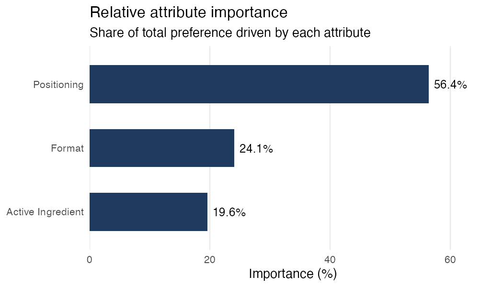
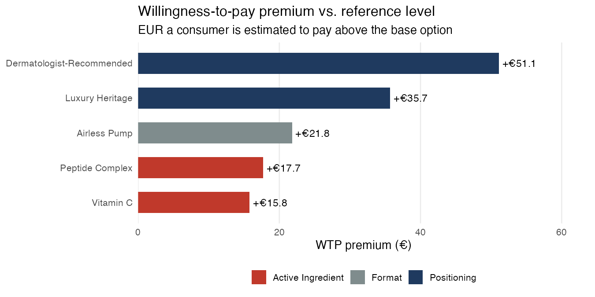
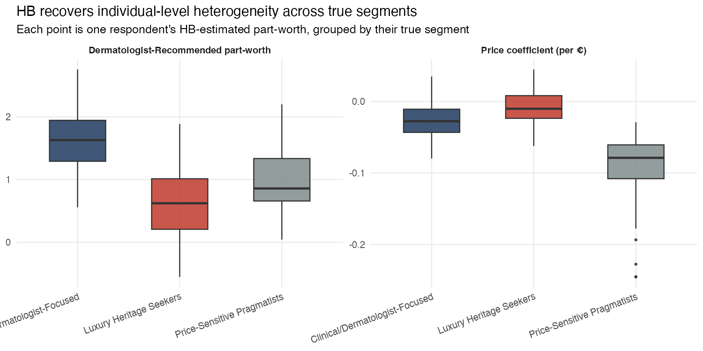
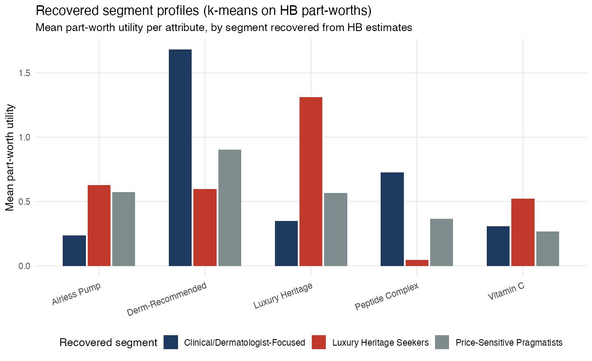
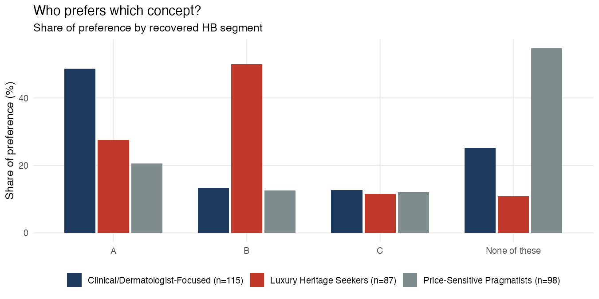
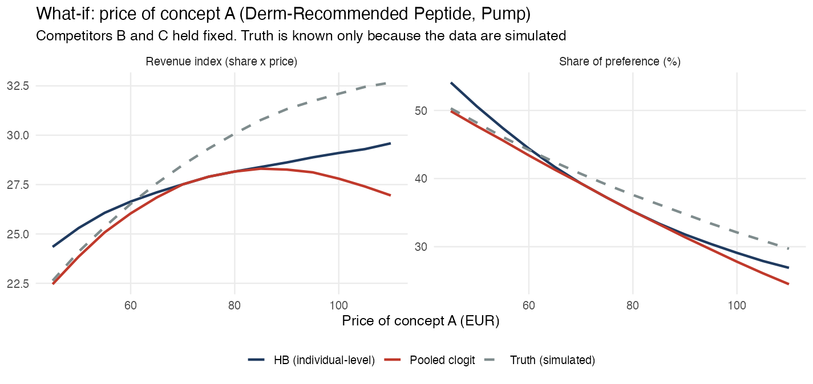

# Choice-Based Conjoint Analysis: Skincare Attribute Preferences, Willingness-to-Pay, and Segmentation

A discrete choice experiment estimating what drives consumer choice of a premium
skincare serum, first with a pooled (aggregate) model, then with Hierarchical
Bayes (HB) to recover individual-level preferences and latent segments. An
extension tests a D-efficient experimental design and builds an
individual-level market simulator.

## Key results

- **The pooled model is biased under heterogeneity.** It understates price
  sensitivity by about a third, estimates a "None" baseline about 20x too weak,
  and overstates the willingness-to-pay premium for dermatologist positioning by
  about 60% (€51 vs. €32 in the simulated truth). See Findings 1 and 2.
- **HB recovers real heterogeneity, with caveats.** Individual price
  sensitivity is recovered well (r = 0.81) and segments are recovered at 72%
  accuracy (adjusted Rand index 0.34, a moderate result). But HB's
  population-level estimates overshoot the truth in magnitude on six of seven
  parameters, which pushes its WTP estimates too low. See Findings 1 to 4.
- **An efficient design gives about 13% smaller standard errors** for the same
  300 respondents (roughly 26% fewer respondents for equal precision). The
  benefit is established for aggregate estimates, not for HB individual-level
  recovery. See Findings 5 and 6.
- **The individual-level simulator changes the pricing conclusion:** the pooled
  model implies an interior revenue optimum near €85, while the truth and HB
  show revenue still rising at €110. See Finding 7.

## Business question

Which product attributes most influence a consumer's choice of skincare serum,
what is each attribute worth in price terms, and is the market really one
audience, or several with different preferences?

Specifically:

- Does a **dermatologist-recommended** positioning justify a price premium over
  a mass-prestige or luxury-heritage story?
- Which **active ingredient claim** (retinol, vitamin C, peptide complex) drives
  the most preference?
- Does **packaging format** (standard bottle vs. airless pump) matter enough to
  justify the cost of switching?
- Do different consumers actually want different things, and if so, does a
  single "average" model hide that, or mislead a launch decision?

## Data

**This is simulated data, not a real consumer panel.** Real conjoint studies
use proprietary respondent data that isn't publicly available for a portfolio
project. To build and demonstrate the full pipeline honestly, I instead:

1. Defined **three latent preference segments** with genuinely different,
   known part-worth utilities (see table below). A single shared set of
   "true" preferences gives an aggregate model nothing to get wrong and
   HB nothing real to recover. Three segments let the project show what each
   method actually can and cannot see.
2. Assigned 300 simulated respondents to segments (35% / 30% / 35%), each with
   individual-level noise around their segment's mean utilities.
3. Generated 10 choice tasks per respondent x 3 product alternatives + a
   "None of these" option (12,000 rows total), with attribute levels assigned
   at random to each alternative.
4. Simulated each respondent's choice using a random-utility-maximisation
   process (their own true utility + Gumbel-distributed noise). This reflects
   the same data-generating assumption underlying the multinomial logit model itself.

Because the true parameters are known at both the population and individual
level, the analysis can do something a real study cannot, which is to **validate
what each model recovers correctly, and what it gets wrong.**

| Attribute | Levels |
|---|---|
| Positioning | Mass-Prestige (ref.), Dermatologist-Recommended, Luxury Heritage |
| Active ingredient | Retinol (ref.), Vitamin C, Peptide Complex |
| Format | Standard Bottle (ref.), Airless Pump |
| Price | €45 / €65 / €85 / €110 (continuous) |

### The three simulated segments

| Segment | Share | Defining preference |
|---|---:|---|
| Clinical/Dermatologist-Focused | 35% | Strong pull to dermatologist-recommended positioning and peptide-complex claims |
| Luxury Heritage Seekers | 30% | Strong pull to luxury-heritage positioning and premium format; low price sensitivity |
| Price-Sensitive Pragmatists | 35% | Weak preferences on positioning/ingredient; much more price-sensitive |

## Method

- **Design:** choice-based conjoint (CBC), 3 alternatives + "None" per task. In
  the main study (scripts 01 to 05) attribute levels are randomised per
  alternative; a production study would use a D-efficient/orthogonal design.
  Step 4 below tests one.
- **Step 1 — pooled estimation:** multinomial logit via `survival::clogit()`
  (conditional logistic regression on matched strata), giving one set of
  "average" part-worths for the whole market.
- **Step 2 — Hierarchical Bayes:** `bayesm::rhierMnlRwMixture()`, the R
  implementation of the HB-MNL method from Rossi, Allenby & McCulloch's
  *Bayesian Statistics and Marketing*, a standard reference for Bayesian methods
  in marketing. This estimates a **separate set of part-worths for every
  respondent**, shrunk toward a population distribution via a Bayesian
  hierarchical prior. The specification is single-component (random
  coefficients): segments are recovered afterward by clustering, not assumed by
  the model.
- **Step 3 — segmentation:** k-means (k=3) on the individual HB part-worths,
  then validated against the true simulated segment labels.
- **Step 4 — efficient design (extension):** a D-efficient, blocked design with
  prohibitions, found by coordinate exchange and compared against the random
  design in replicated simulations (scripts 06 and 07).
- **Step 5 — market simulator (extension):** share-of-preference and
  first-choice simulation on each respondent's own HB part-worths, with a price
  what-if and segment-level shares (script 08).

Reproduce with (R 4.3, packages: `survival`, `bayesm`, `dplyr`, `tidyr`,
`ggplot2`, `scales`). Run from the repository root, since the scripts use
relative paths:

```bash
Rscript scripts/01_simulate_data.R
Rscript scripts/02_estimate_model.R
Rscript scripts/03_business_outputs.R
Rscript scripts/04_hb_estimation.R        # ~20 seconds for 8,000 MCMC draws
Rscript scripts/05_hb_visualization.R
Rscript scripts/06_efficient_design.R     # after 01; D-efficient blocked design (~10 sec)
Rscript scripts/07_design_comparison.R    # after 06; random vs. efficient, replicated (~3 min)
Rscript scripts/08_market_simulator.R     # after 02 and 04; HB simulator + price what-if
Rscript scripts/09_bias_and_wtp_check.R   # after 04; scale check, WTP comparison, ARI
```

## Results

### Finding 1 — the pooled model is biased under heterogeneity, and HB errs in the opposite direction

This is the headline finding, and it's a real, well-documented phenomenon:
when a population has genuinely different preferences, a pooled
multinomial logit doesn't just fail to see the segments, its *aggregate*
estimates can be biased, because average choice probability across
heterogeneous individuals is not the same as choice probability evaluated at
the average individual (a nonlinearity in the logit link, sometimes called
aggregation bias). The table compares each model's population-level estimate
with the average true utility of the 300 simulated respondents (the fair
benchmark, since HB only sees those 300):

| Parameter | True (sample avg.) | Pooled clogit | Pooled ÷ true | HB population mean | HB ÷ true |
|---|---:|---:|---:|---:|---:|
| Dermatologist-Recommended | 0.811 | 0.880 | 1.08 | 1.113 | 1.37 |
| Luxury Heritage | 0.455 | 0.615 | 1.35 | 0.699 | 1.54 |
| Vitamin C | 0.292 | 0.272 | 0.93 | 0.357 | 1.22 |
| Peptide Complex | 0.482 | 0.305 | 0.63 | 0.412 | 0.85 |
| Airless Pump | 0.335 | 0.376 | 1.12 | 0.459 | 1.37 |
| Price (per €) | -0.025 | **-0.017** | **0.68** | **-0.042** | **1.67** |
| None (baseline) | -0.939 | **-0.047** | **0.05** | **-1.905** | **2.03** |

(The population-weighted expectations from the simulation design, for example
0.790 for dermatologist positioning, are in `outputs/scale_check.csv`.)

**The pooled model misses in both directions.** It understates price
sensitivity by about a third (ratio 0.68, roughly seven standard errors from
the truth, so this is not sampling noise) and estimates a "None" baseline about
20x too weak. It also overshoots luxury heritage by about a third and
undershoots peptide complex by over a third.

**HB misses the other way.** Its population means are 22% to 103% larger in
magnitude than the truth on six of the seven parameters (peptide complex, at
0.85, is the exception), and its price coefficient is 67% too steep. On price
and on the "None" baseline the truth sits between the two methods. This project
does not isolate why HB overshoots. Limited information from 10 tasks per
respondent and the default priors are plausible contributors, but neither is
tested here.

Since willingness-to-pay is calculated as *attribute utility ÷ price
coefficient*, errors in the price coefficient flow straight into WTP
(Finding 2). This is an example of why a launch decision based only on a pooled
model can be misleading, and why HB output should be checked for scale and not
only for ranking.

### Finding 2 — aggregate view: attribute importance and WTP



With price included (its utility range measured over the tested €45 to €110),
**price is the largest driver in the pooled model at 41.8%**, ahead of
positioning (32.8%), format (14.0%) and active ingredient (11.4%). Among the
non-price attributes alone, positioning leads clearly. Because the pooled price
coefficient is too small (Finding 1), its price importance is itself likely
understated: using the true average coefficients, price would account for about
half. Importance also depends on the tested price range.



The pooled model estimates a dermatologist-recommended positioning is worth
**+€51** over a mass-prestige story. Comparing the three sources, using each
model's population-mean coefficients (`outputs/wtp_comparison.csv`):

| Premium vs. reference level | Pooled clogit | HB population mean | Truth (sample avg.) | Pooled error | HB error |
|---|---:|---:|---:|---:|---:|
| Dermatologist-Recommended | €51.2 | €26.4 | €32.2 | +59% | -18% |
| Luxury Heritage | €35.8 | €16.6 | €18.0 | +99% | -8% |
| Vitamin C | €15.8 | €8.4 | €11.6 | +36% | -28% |
| Peptide Complex | €17.8 | €9.8 | €19.1 | -7% | -49% |
| Airless Pump | €21.9 | €10.9 | €13.3 | +65% | -18% |

The pooled model overstates WTP on four of five levels (by up to 99%), as
Finding 1 predicts. HB understates WTP on all five (by 8% to 49%) and is closer
to the truth on four of five levels. Neither is exact: the truth lies between
them. A real study would treat a pooled WTP figure with real caution, which is
also the argument for running HB before finalizing a pricing recommendation,
and for checking its scale before quoting it.

### Finding 3 — HB recovers real, separable heterogeneity



Individual-level HB part-worths, grouped by each respondent's *true* (unknown
to the model) segment, separate cleanly, especially on price sensitivity,
where the three segments barely overlap. This is the core value HB adds over
a pooled model: it recovers structure that the pooled model cannot see at all.

**Individual-level recovery quality** (correlation between each respondent's
HB-estimated and true part-worth, across all 300 respondents):

| Parameter | Correlation | Mean abs. error |
|---|---:|---:|
| Price (per €) | 0.808 | 0.025 |
| Luxury Heritage | 0.631 | 0.426 |
| Dermatologist-Recommended | 0.615 | 0.502 |
| Peptide Complex | 0.442 | 0.324 |
| Airless Pump | 0.252 | 0.301 |
| Vitamin C | 0.240 | 0.304 |
| None (baseline) | 0.305 | 1.028 |

Price is recovered best (it's the only continuous variable, observed on every
row, giving the model the most information per respondent). The categorical
attribute dummies are recovered more modestly, reflecting a realistic and expected
result given only 10 choice tasks per respondent (see *Limitations*).
Correlations measure whether respondents are ranked correctly, not whether the
scale is right; the scale overshoot in Finding 1 is a separate issue.

### Finding 4 — segment recovery from HB + k-means



Clustering the individual HB part-worths (k-means, k=3) and comparing against
the true simulated segment labels:

| True segment | Recovered as Cluster 1 | Cluster 2 | Cluster 3 |
|---|---:|---:|---:|
| Clinical/Dermatologist-Focused | **80** | 8 | 20 |
| Luxury Heritage Seekers | 10 | **71** | 13 |
| Price-Sensitive Pragmatists | 25 | 8 | **65** |

**Overall recovery accuracy: 72%** (best cluster-to-segment matching), against
36% for simply assigning everyone to the largest segment. The adjusted Rand
index is **0.34** (0 = chance, 1 = perfect), so recovery is well above chance
but moderate. Cluster 1 clearly over-indexes on dermatologist positioning and
peptide complex, Cluster 2 on luxury heritage, and Cluster 3 is the
flattest/most price-driven profile. The profiles are directionally correct and
useful for describing the market, but not reliable enough to assign individual
respondents: 28% land in the wrong segment. This is expected given the sample
design (see *Limitations*).

## Extension: design efficiency and market simulation

Findings 5 to 7 extend the original study. The main dataset and results above
(scripts 01 to 05) are unchanged. The efficient-design data are kept separate in
`data/efficient_design.csv` and `data/simulated_choices_efficient.csv`.

### Finding 5 — a constrained, efficient design buys precision and removes implausible concepts

The original experiment assigns attribute levels at random (see *Limitations*).
Script 06 replaces that with a **D-efficient, blocked design** found by coordinate
exchange: 60 choice tasks of 3 alternatives plus "None", split into 6 blocks of
10 tasks so each respondent still answers 10.

Design rules:

- **Prohibitions:** Luxury Heritage is never shown at €45 and Mass-Prestige is
  never shown at €110, since neither concept is credible. The random design showed
  **1,489 of 9,000 alternatives (16.5%)** that break these rules; the efficient
  design shows none.
- **No duplicate alternatives** within a task.
- **Minimum level balance:** every level must appear at least 70% as often as
  under perfect balance, so the search cannot collapse onto extreme prices only.
- **Planning priors** are pilot-style guesses (modest positive part-worths,
  mildly negative price), *not* the simulation's true values. The "None" constant
  is calibrated to the None share in the random-design data (31%).

Relative D-efficiency is **1.26**: the random design would need roughly
**26% more respondents** to match the efficient design's overall precision.
The comparison bundles two changes (optimised levels and prohibitions), but the
efficient design is the more constrained of the two, so the gain does not come
from removing restrictions. Script 07 tests whether the predicted gain holds up,
re-simulating choices for the same 300 respondents under each design
(30 replications, pooled clogit):

| Parameter | Predicted SE ratio (efficient / random) | Realised SE ratio (30 replications) |
|---|---:|---:|
| Dermatologist-Recommended | 0.864 | 0.885 |
| Luxury Heritage | 0.924 | 0.936 |
| Vitamin C | 0.881 | 0.890 |
| Peptide Complex | 0.887 | 0.864 |
| Airless Pump | 0.868 | 0.873 |
| Price (per €) | 0.876 | 0.836 |
| None (baseline) | 0.774 | 0.772 |

Standard errors are **about 13% smaller** on average (average ratio 0.865), and
the realised values track the predicted ones closely. Pooled estimates remain
biased under heterogeneity (Finding 1), so precision, not bias, is the fair
comparison here.

### Finding 6 — the efficient design's edge shows at the population level, not (yet) the individual level

Running the same comparison through Hierarchical Bayes (3 replications per design,
correlation with true individual part-worths):

| Parameter | Random design | Efficient design | Change |
|---|---:|---:|---:|
| Dermatologist-Recommended | 0.623 | 0.698 | +0.074 |
| Luxury Heritage | 0.602 | 0.638 | +0.036 |
| Vitamin C | 0.321 | 0.254 | -0.066 |
| Peptide Complex | 0.444 | 0.466 | +0.021 |
| Airless Pump | 0.281 | 0.228 | -0.053 |
| Price (per €) | 0.773 | 0.819 | +0.046 |
| None (baseline) | 0.278 | 0.104 | -0.174 |

The results are **mixed**: four parameters improve and three get worse. With only
3 replications this is within plausible noise, so the honest conclusion is that
an HB improvement is **not established**. This is not surprising. The design was
optimised for population-level information, and individual-level recovery is capped
by having only 10 tasks per respondent, whatever the design. Testing a design tuned
for HB (for example, prior-based Bayesian efficiency) with more replications is the
natural next step.

### Finding 7 — an individual-level simulator changes the pricing conclusion, not the headline shares

Script 03 simulates preference share from the pooled model. Script 08 adds a
simulator built on each respondent's own HB part-worths, with share-of-preference
and first-choice rules and what-if scenarios.

**Base market.** For the same three concepts, HB and pooled shares agree within
about 2 points on every option (A: 33.4% vs 33.3%, B: 23.8% vs 24.0%, C: 12.2% vs 13.9%,
None: 30.6% vs 28.8%). The first-choice rule is winner-takes-all and exaggerates
concentration (concept C falls to 0%), which is why share-of-preference is the
more usual default.

**Who prefers what.** A pooled model, which has no segments, cannot produce this view:



Concept A wins with the clinical segment (49%), concept B wins with luxury seekers (50%),
and the price-sensitive segment mostly chooses None (55%). The cluster names come
from matching each cluster to the true segment it overlaps most, which is possible
only because the data are simulated; in a real study they would be named from
their part-worth profiles.

**Price what-if.** Sweeping concept A's price from €45 to €110 with competitors
held fixed, and benchmarking against the known simulated truth (possible only because
the data are simulated):



| Model | Share at €45 | €65 | €85 | €110 | Mean abs. error vs truth | Revenue-index peak |
|---|---:|---:|---:|---:|---:|---:|
| HB (individual-level) | 54.1% | 41.7% | 33.4% | 26.9% | 2.3 pts | €110 |
| Pooled clogit | 49.9% | 41.3% | 33.3% | 24.5% | 2.4 pts | €85 |
| Truth (simulated) | 50.3% | 42.4% | 36.2% | 29.7% | 0.0 | €110 |

Share-curve accuracy is essentially tied. The difference is in the **pricing
conclusion**: the pooled model implies an interior revenue optimum near €85 with
revenue falling above it, while both the truth and HB show revenue still rising at
the top of the tested range. This links back to Finding 1: the pooled model's
biased price coefficient can point to the wrong price recommendation. HB gets the
direction right, but its share curve is steeper than the truth's (consistent with
its over-steep price coefficient), so its revenue index rises more slowly than
the truth's. Since the peak sits on the edge of the tested range, it is best read
as "not yet identified" rather than as an optimum.

## Limitations

**Study design**

- **Simulated, not real, respondents.** Results describe a simulated market
  built to validate the pipeline, not actual consumer preferences.
- **Random rather than efficient design in the main study.** Scripts 01 to 05
  use random assignment rather than a D-efficient/orthogonal design. Finding 5
  shows an efficient design would reduce standard errors for the same sample
  size, but the main results above were not re-run on it.
- **Only 10 choice tasks per respondent.** This is on the lean side for CBC
  (production studies often use 12-20). It's a real driver of the modest
  individual-level correlations in Finding 3 and the imperfect segment
  recovery in Finding 4. HB needs enough within-respondent variation to
  separate a person's true preferences from noise, and 10 tasks is a
  meaningful constraint on that.
- **Linear price utility and no interaction effects.**

**Estimation**

- **The "None" baseline is hard for both models to pin down.** The pooled clogit
  estimate is about 20x too weak; HB's is about 2x too strong. Alternative-specific
  constants like this are known to be harder to identify precisely than attribute
  part-worths, and this project doesn't fully resolve why the two methods err in
  opposite directions. It is worth flagging honestly rather than picking whichever
  number looks better.
- **HB population-level estimates are inflated in magnitude on most parameters**
  (Finding 1), not only on "None." The cause is not isolated here, and it leads
  HB to understate WTP (Finding 2).
- **HB run with a single mixture component (ncomp = 1),** i.e. continuous
  individual heterogeneity via one multivariate normal, with segments
  recovered afterward via k-means. This mirrors common commercial practice
  (HB first, cluster after) but means the model itself doesn't "know" there are
  3 segments; that structure is recovered, not assumed.
- **Segment recovery is moderate** (72% accuracy, adjusted Rand index 0.34), so
  the recovered segments describe the market but should not be used to label
  individual respondents.
- **No formal MCMC convergence diagnostics** (trace plots, Gelman-Rubin,
  effective sample size) were run. Burn-in was fixed at 50% of draws as a
  simple, conservative default rather than something empirically checked.
- **WTP is computed as a ratio of population means.** Ratios of individual-level
  estimates give different (and less stable) results, especially for respondents
  whose price coefficient is close to zero.

**Extension**

- **The efficient design is tested on simulated data only, and tuned to assumed
  priors.** If real preferences differ from the planning priors, the efficient
  design loses some of its advantage; a robust (Bayesian-prior) design would
  hedge against that.
- **Price levels are pushed to the extremes** (34% at €45, 29% at €110, 17% to 19%
  in the middle) because D-efficiency favours the extremes for a linear price term.
  This limits how well non-linear price effects could be detected.
- **HB gains from the efficient design are not established** (3 replications,
  mixed results).
- **The revenue-index peak in the price scenario sits on the edge of the tested
  range** (€110), so it is not an identified optimum. Also, "share of preference"
  is not market share: there is no awareness, distribution, or cost information,
  and the revenue index ignores cost.
- **The design search is a hand-written coordinate-exchange routine**
  (`helpers_design.R`), not a validated package. Cross-checking against `idefix`
  would be a sensible next step.

## Repo structure

```
├── data/
│   ├── simulated_choices.csv              # respondent-level choice data (long format)
│   ├── respondent_true_utilities.csv      # ground-truth individual-level utilities + segment
│   ├── true_utilities.rds                 # population-weighted-average ground truth
│   ├── true_segment_utilities.rds         # ground-truth utilities per segment
│   ├── true_segment_shares.csv            # true segment sizes
│   ├── efficient_design.csv               # D-efficient design: 6 blocks x 10 tasks x 3 alternatives
│   └── simulated_choices_efficient.csv    # one dataset simulated under the efficient design
├── scripts/
│   ├── 01_simulate_data.R                 # 3-segment experiment design + choice simulation
│   ├── 02_estimate_model.R                # pooled clogit estimation + validation vs. truth
│   ├── 03_business_outputs.R              # pooled-model importance (incl. price), WTP, preference share
│   ├── 04_hb_estimation.R                 # Hierarchical Bayes MNL (bayesm) + validation + k-means
│   ├── 05_hb_visualization.R              # heterogeneity and segment-profile charts
│   ├── helpers_design.R                   # shared functions: design search, choice simulation, HB fitting
│   ├── 06_efficient_design.R              # D-efficient blocked design with prohibitions + diagnostics
│   ├── 07_design_comparison.R             # random vs. efficient design, replicated (clogit + HB)
│   ├── 08_market_simulator.R              # individual-level HB simulator, price what-if, segment shares
│   └── 09_bias_and_wtp_check.R            # pooled vs. HB vs. truth: scale check, WTP, adjusted Rand index
├── outputs/                               # all CSVs, PNGs, and saved model objects
│   ├── efficient_design/                  # design diagnostics, level balance, precision and recovery tables
│   └── simulator/                         # scenario tables and charts from script 08
└── README.md
```
